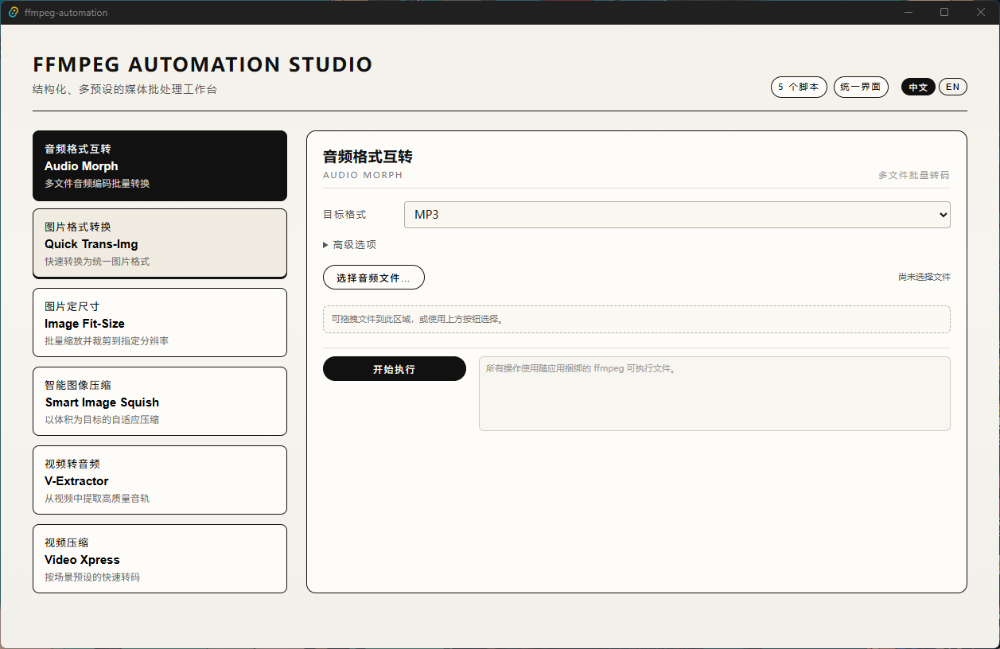

# FFmpeg Automation Studio

FFmpeg 批处理前端工具，提供直观的图形界面完成常见的媒体处理任务。

## 功能

- **音频格式互转** — 多文件批量转换音频格式（MP3 / AAC / OGG / WAV / FLAC）
- **图片格式转换** — 快速统一图片后缀
- **图片定尺寸** — 批量缩放裁剪到指定分辨率
- **智能图像压缩** — 以体积为目标的 AVIF / WebP 自适应压缩
- **视频转音频** — 从视频文件中提取高质量音轨
- **视频压缩** — 预设驱动的快速转码（NVENC / x264 / x265）



## 获取

### Windows

从 [Releases](https://github.com/Flechazo098/ffmpeg-automation/releases) 下载最新版本的安装包，直接运行即可。

### Linux / macOS

v0.2.0 之后不再提供 Linux 和 macOS 的预构建二进制，请自行拉取源码构建：

```bash
# 前端依赖
npm install

# 开发模式
npm run tauri dev

# 构建
npm run tauri build
```